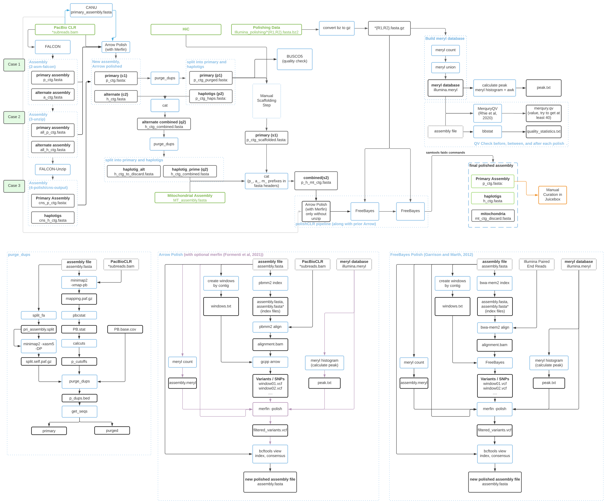

## Nextflow polishCLR pipeline

  

*polishCLR* is a [nextflow](https://www.nextflow.io/) workflow for polishing genome assemblies (improving accuracy) generated with noisy PacBio reads using accurate, short Illumina reads. It implements the best practices described by the Vertebrate Genome Project (VGP) Assembly community (Rhie et al. 2021) and extends these for use-cases we found common in the [Ag100Pest Genome Initiative](http://i5k.github.io/ag100pest). This workflow was developed as part of the USDA-ARS Ag100Pest Initiative. The authors thank members of the USDA-ARS Ag100Pest Team and SCINet Virtual Resource Support Core (VRSC) for fruitful discussions and troubleshooting throughout the development of this workflow. 

The polishCLR workflow can be easily initiated from three input cases:
- Case 1: An unresolved primary assembly with associated contigs (the output of FALCON 2-asm) or without (e.g., the output of Canu or wtdbg2). 
- Case 2: A haplotype-resolved but unpolished set (e.g., the output of FALCON-Unzip 3-unzip). 
- **Case 3: IDEAL! A haplotype-resolved, CLR long-read, Arrow-polished set of primary and alternate contigs (e.g., the output of FALCON-Unzip 4-polish).** 

We strongly recommend including the organellular genome to improve the polishing of nuclear mitochondrial or plasmid pseudogenes (Howe et al., 2021). Organelle genomes should be generated and polished separately for best results. You could use the mitochondrial companion to polishCLR, [polishCLRmt](https://github.com/Ag100Pest/Ag100MitoPolishCLR) or [mitoVGP](https://github.com/gf777/mitoVGP) (Formenti et al., 2021). 

To allow for the inclusion of scaffolding before final polishing  and increase the potential for gap-filling across correctly oriented scaffolded contigs, the core workflow is divided into two steps, controlled by a `--step` parameter flag. 

You can view a more complete visualization of the pipeline in [Supp. Fig. S1](imgs/FigureS01.svg)

